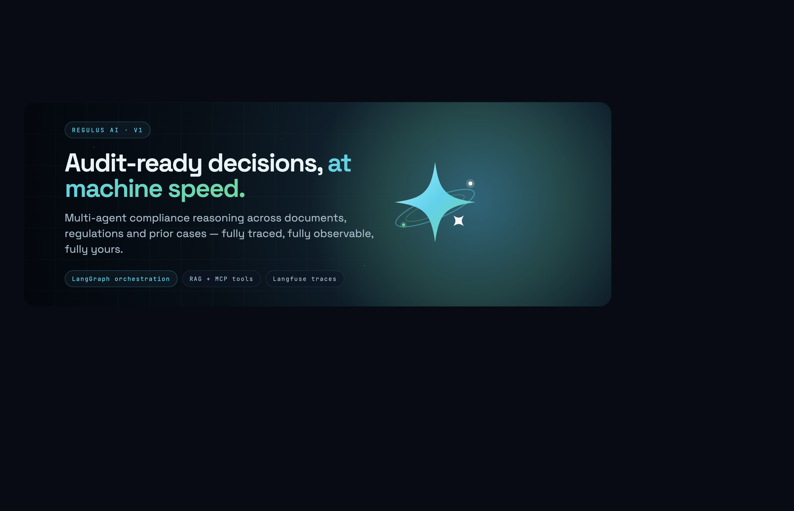
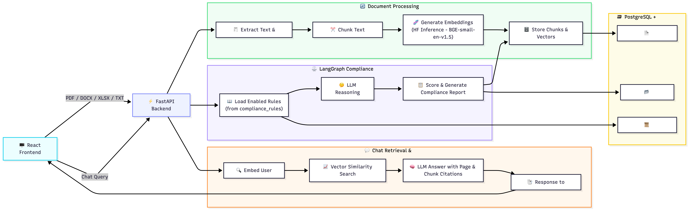

# Regulus AI — Self-Hosted Compliance Triage & Document Chat

A locally-deployed toolkit that ingests business documents, indexes them with
embeddings, evaluates each one against a set of compliance rules **you define**,
and lets you chat with the indexed corpus.

> **Bring your own rules. Run it on your own machine. No data leaves your server.**

---

## What it actually does

When you upload a document, the backend runs this pipeline end-to-end:

1. **Extract** — PDF / DOCX / XLSX / TXT → text + per-page metadata (PyMuPDF, openpyxl, ZIP-based DOCX)
2. **Chunk** — page-anchored recursive splitter (`tiktoken` cl100k_base, 512-token target, 64-token overlap)
3. **Embed** — each chunk → 384-dim vector via Hugging Face Inference (`BAAI/bge-small-en-v1.5` by default)
4. **Store** — chunks + vectors saved into a pgvector column on the same Postgres
5. **Compliance graph** — 3-node LangGraph agent (Retrieve → Reason → Score) evaluates the document against your active rules and produces a structured report
6. **Chat** — ask questions about any indexed document; answers cite specific pages and chunks

Every stage prints a labelled trace to the backend terminal so you can see exactly what ran.

---

## Use cases

This is a **triage tool**, not a replacement for legal review. Real-world fits:

- **Contract pre-screening** — flag missing DPAs, encryption clauses, indemnification, etc. before sending to a lawyer
- **Vendor due diligence** — security questionnaire / privacy policy gap analysis at scale
- **Internal policy audit** — find policies missing required sections (encryption, data retention, access control…)
- **Pre-audit prep** — surface obvious SOC 2 / ISO / GDPR gaps before the auditor visits
- **RFP responses** — map enterprise security addendums to your existing internal controls

> Findings always need human review. The point is to catch the obvious gaps in 30 seconds so your humans can spend their hour on the subtle ones.

---

## User-editable compliance rules

The Rules page lets you:

- Add unlimited custom rules under any framework label (GDPR, HIPAA, PCI-DSS, "Internal Policy v3"…)
- Edit rule text, severity, and framework freely
- Disable rules without deleting them
- Delete any rule (defaults included)
- Restore the default 15-rule set with one button

Default rule set seeded on first boot: 5 rules each for **GDPR**, **SOC 2**, and **ISO 27001**.

### About frameworks

Framework names are **labels**, not knowledge sources. We don't ship the GDPR text or the SOC 2 Trust Services Criteria. The actual compliance check lives in each rule's `check` field — the LLM evaluates the document against that text. The framework name groups rules in the UI and lets you scope evaluation per upload.

---

## Document chat

- Scope chats to a single document or run them across all indexed content
- Answers cite the exact pages and chunks they came from (collapsed by default; click *View references* to expand)
- Conversation persists across page navigation via `sessionStorage`
- "Chat about this document" button on the Results page jumps straight to a fresh, scoped conversation
- Uses the same vector store and LLM provider as the compliance agent — no extra setup

---

## Architecture



- **Backend**: FastAPI + SQLAlchemy + Postgres + pgvector + LangGraph
- **Frontend**: React (Vite) — Dashboard / Ingest / Rules / Chat / Results
- **Embeddings**: Hugging Face Inference, default `BAAI/bge-small-en-v1.5` (384-dim)
- **LLM**: Hugging Face Inference (default, tested on Llama 3.1 8B Instruct) — Anthropic Claude implemented as a swap-in
- **Agents**: 3-node LangGraph state machine — Retrieve, Reason, Score
- **Vector DB**: pgvector extension — same Postgres instance as job data

---

## Quickstart

### Prerequisites

- macOS or Linux
- **Postgres 15+** running locally on `5432`
- **pgvector** extension available (e.g. `brew install pgvector` on macOS Homebrew)
- A database named `regulus_ai` owned by your local Postgres user
- Node.js + npm
- Python 3.11+
- A free Hugging Face access token — <https://huggingface.co/settings/tokens>

### One-time setup

```bash
make setup
cp backend/.env.example backend/.env
```

Edit `backend/.env`:

- `DB_USER` — your Postgres username
- `HF_API_TOKEN` — your Hugging Face token

On first boot, the backend will:

- Enable the `vector` Postgres extension
- Run schema migrations
- Seed the 15 default compliance rules

### Run it

```bash
make dev
```

- Backend: <http://127.0.0.1:8000>
- Frontend: <http://127.0.0.1:5173>

Or start each separately:

```bash
make backend
make frontend
```

---

## Configuration

Everything sensitive lives in `backend/.env` (gitignored):

```env
DB_HOST=localhost
DB_PORT=5432
DB_USER=<your postgres user>
DB_NAME=regulus_ai

HF_API_TOKEN=<your hugging face token>
EMBEDDING_MODEL=BAAI/bge-small-en-v1.5
EMBEDDING_DIMENSIONS=384

LLM_PROVIDER=huggingface       # or "anthropic"
LLM_MODEL=meta-llama/Llama-3.1-8B-Instruct
ANTHROPIC_API_KEY=             # optional; only needed for LLM_PROVIDER=anthropic
ANTHROPIC_MODEL=claude-haiku-4-5
```

Switching providers is a one-line change — no code edits.

---

## Pipeline trace

Every upload prints a stage-by-stage trace to the backend terminal:

```
──── [UPLOAD]   job_id=8a1c…  file=contract.pdf  size_kb=276.3
──── [EXTRACT]  engine=pymupdf  pages=4  encrypted=False  characters=8421
──── [ANALYZE]  entities_found=12  issues=2  score=85
──── [CHUNK]    target_tokens=512  overlap_tokens=64  → 6 chunks / 2,740 tokens
──── [EMBED]    model=BAAI/bge-small-en-v1.5  dim=384  time=2.1s
──── [DB]       table=document_chunks  upserted=6
──── [AGENT.RETRIEVE]  frameworks=GDPR,SOC2,ISO27001  rules_loaded=15
──── [AGENT.REASON]    provider=huggingface  attempt 1: parsed 15 findings
──── [AGENT.SCORE]     score=72  label=Mostly Compliant
──── [DONE]            2 chunks indexed; compliance score=72
```

Chat fires a similar `[CHAT]` trace with embedding time, retrieval time, and LLM time per request.

---

## Data model

| Table              | Purpose                                                                   |
|--------------------|---------------------------------------------------------------------------|
| `document_jobs`    | Uploaded files — status, extracted text, entities, compliance report      |
| `document_chunks`  | Per-page chunks with embeddings (`vector(384)`); cascade-deleted          |
| `compliance_rules` | Your editable rule catalog — defaults seeded on first boot                |

---

## API surface

| Method | Path                          | Purpose                                                |
|--------|-------------------------------|--------------------------------------------------------|
| `POST` | `/upload`                     | Multipart file + optional `frameworks` form field      |
| `GET`  | `/status/{id}`                | Job status polling                                     |
| `GET`  | `/result/{id}`                | Final extraction + compliance report                   |
| `GET`  | `/jobs`                       | List documents (powers chat scope dropdown)            |
| `GET`  | `/dashboard`                  | Recent jobs + aggregated stats                         |
| `GET`  | `/search`                     | Cosine vector search over chunks                       |
| `POST` | `/chat`                       | `{question, job_id?, history?}` → answer + citations  |
| `GET`  | `/rules`                      | List rules (filter by framework / enabled-only)        |
| `POST` | `/rules`                      | Create a new rule                                      |
| `PUT`  | `/rules/{id}`                 | Update a rule                                          |
| `DELETE`| `/rules/{id}`                | Delete a rule                                          |
| `POST` | `/rules/restore-defaults`     | Re-seed any missing default rules                      |
| `GET`  | `/frameworks`                 | Distinct framework labels currently in use             |
| `GET`  | `/health`                     | Liveness check                                         |

---

## Honest scope

### What IS implemented

- Native PDF / DOCX / XLSX / TXT extraction with metadata, encryption + corruption handling, page caps, and per-page output
- Page-anchored recursive chunking (`tiktoken`, 512 target / 64 overlap)
- pgvector embeddings + cosine search
- LangGraph 3-node compliance agent (Retrieve → Reason → Score) with JSON-parse retries
- User-editable rules CRUD with custom frameworks
- Document chat with cited references
- HF Inference + Anthropic providers (HF tested; Anthropic wired but untested)
- Stdout pipeline traces for every upload and chat request

### What ISN'T (yet)

- **OCR** for scanned documents — pipeline flags low-text pages for a future v2 fallback
- **MCP tool calling** — the agent does NOT invoke external tools today
- **Langfuse observability** — traces are stdout only; no prompt versioning or token telemetry
- **Reranking** — vector search is single-stage cosine
- **Reference documents for frameworks** — "GDPR" is a label; the LLM uses its training knowledge plus your rule text. A real production version would index the actual regulatory corpus
- **Multi-user auth** — single-tenant by design
- **Docker / CI / cloud deploy** — runs locally; no deploy automation yet

---

## Local-first by design

- All uploads land in `backend/uploads/`
- Jobs, chunks, embeddings, and rules live in your local Postgres
- The only outbound calls are to Hugging Face Inference (or Anthropic, if you configure it)
- Swap to a fully offline LLM (Ollama, llama.cpp) by adapting `app/agents/llm.py` — the interface is provider-agnostic

---

## Repository

`agentic-docs-ai` on GitHub.
